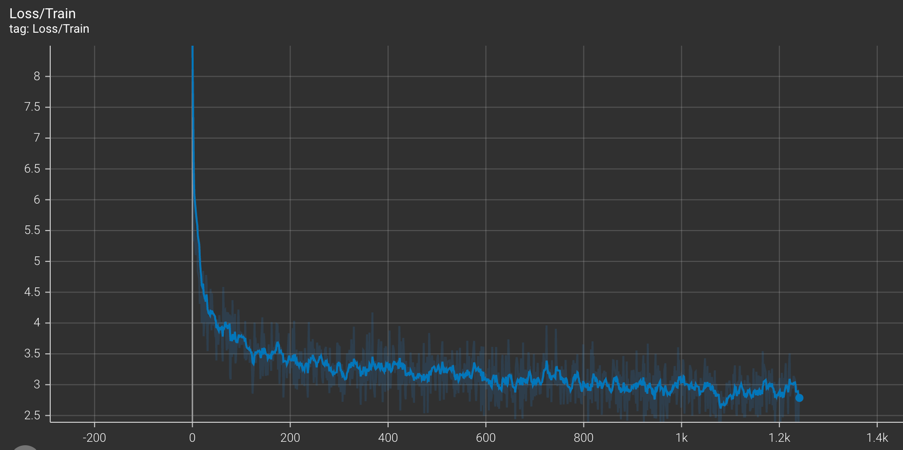
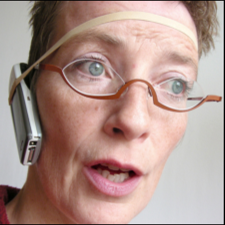
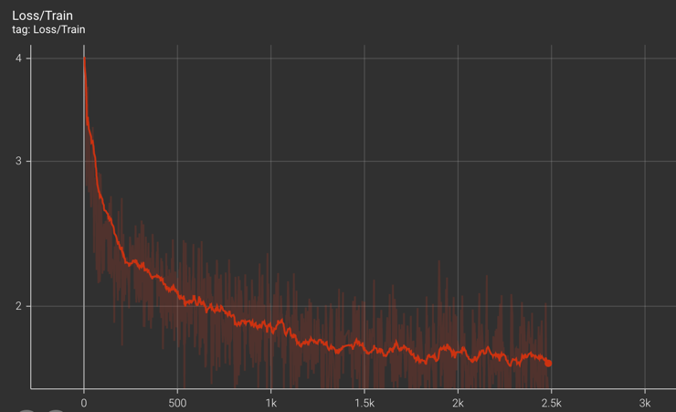
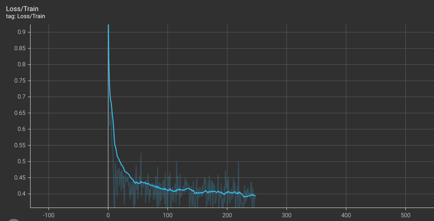

# Assignment 4: Visual Question Answering with PyTorch

Model checkpoints and run logs: https://drive.google.com/drive/folders/1cgssoCF1QefHnc727wcMPLKndYioRosu?usp=sharing

## Run baseline:

`python student_code/main.py --model simple --train_image_dir data/train2014 \
--train_question_path data/MultipleChoice_mscoco_train2014_questions.json \
--train_annotation_path data/mscoco_train2014_annotations.json \
--test_image_dir data/val2014 \
--test_question_path data/MultipleChoice_mscoco_val2014_questions.json \
--test_annotation_path data/mscoco_val2014_annotations.json \
--log_validation
--exp_name simple`

## Run coattention:

`python student_code/main.py --model coattention --train_image_dir data/train2014 \
--train_question_path data/MultipleChoice_mscoco_train2014_questions.json \
--train_annotation_path data/mscoco_train2014_annotations.json \
--test_image_dir data/val2014 \
--test_question_path data/MultipleChoice_mscoco_val2014_questions.json \
--test_annotation_path data/mscoco_val2014_annotations.json \
--log_validation
--exp_name coattention`

## Run coattention with cosine distance loss:

`python student_code/main.py --model coattention --train_image_dir data/train2014 \
--train_question_path data/MultipleChoice_mscoco_train2014_questions.json \
--train_annotation_path data/mscoco_train2014_annotations.json \
--test_image_dir data/val2014 \
--test_question_path data/MultipleChoice_mscoco_val2014_questions.json \
--test_annotation_path data/mscoco_val2014_annotations.json \
--log_validation
--exp_name cosine_coattention`

**1.1 Which member function of the `VQA` class returns the IDs of all questions in this dataset? How many IDs are there?**

- getQuesIds, 248349

**1.2 What is the content of the question of ID `409380`? What is the ID of the image associated with this question?**

- question: 'What position is the man squatting with a glove on playing?'  
 image_id: 40938  
 question_id: 409380  

**1.3 What is the mostly voted answer for this question?**

- Catcher

**1.7 Assign `self.answer_to_id_map` in the `__init__` function. Different from the word-level question embedding, the answer embedding is sentence-level (one ID per sentence). Why is it?**

- The answers should capture more global semantic information and must therefore be encoded at a sentence level. The predicted answer doesn't need 
  to match the ground truth answer on a word level because here ordering and context of words matter (for e.g. if "yes" is a correct 
  answer than so should be "yeah"). Whereas with questions, special words can convey useful information about the nature of the question. For 
  example, the start words - How, Why, What and so on. 

**1.8 Implement the `__len__` function of the `VqaDataset` class. Should the size of the dataset equal the number of images, questions or the answers? Show your reasoning.**

- The size of the dataset should be equal to the number of questions. Since the problem setting here is to predict the answer given an image and a corresponding question i.e. `max&theta; P&theta;(answer | image, question)` it only makes sense to have as many number of data samples as the number of inputs. Each image can have multiple questions associated with it. Therefore, it is the number of questions that determine the number of unique samples in the dataset. The answers constitute potential target outputs for (question, image) pairs. An answer can be common across multiple such input pairs (For instance "yes" or "no" answers). Therefore, having answers determine the number of data samples can lead to potentially missing some (image, question) pairs in training. Moreover, each question is tied to all it's potential answers in the VQA API which means availability of all questions means availability of all answers. 

3. Create **word-level one-hot encoding** for the question. Make sure that your implementation handles words not in the vocabulary. You also need to handle sentences of varying lengths. Check out the `self._max_question_length` parameter in the `__init__` function. How do you handle questions of different lengths? Describe in words, what is the dimension of your output tensor?
 
 - Handling sentences of varying length: For every question, I truncate it to `self._max_question_length (=26)`. I then create a one-hot-encoding of size `self._max_question_length (=26), self.question_word_list_length (=5747)`. Incase the question is less than 26 words it is appended with zero vectors. 

 - dimension of output tensor - (26, 5747)

4. Create sentence-level **one-hot encoding** for the answers. 10 answers are provided for each question. Encode each of them and stack together. Again, make sure to handle the answers not in the answer list. What is the dimension of your output tensor?

- Each answer is one-hot-encoded to a tensor of length `(number_of_answers (=10), answer_list_length (= 5217))`

## Task 2: Simple Baseline (30 points)

**2.1 This paper uses 'bag-of-words' for question representation. What are the advantage and disadvantage of this type of representation? How do you convert the one-hot encoding loaded in question 1.9 to 'bag-of-words'?**

- Advantages: Provides a very simple representation of textual data that can ecode information information about the occurence (or/and the 
  frequency of occurence) of words. It is 
  therefore a 
  very 
  popular choice of encoding in NLP and Retrieval tasks. 
- Disadvantages: It doesn't encode information about the (i) semantic relationships and distance between 
different words and consequently
(ii) the context in which a word has been used.
- One hot encoding can be converted to bag-of-words representation by taking a max or a sum along the dimension correspnding to the length of the 
  question. 

**2.2 What are the 3 major components of the network used in this paper? What are the dimensions of input and output for each of them (including batch size)? In `student_code/simple_baseline_net.py`, implement the network structure.**

| Component                  | Architecture | Input | Output|
|----------------------------|-----|------|------|
| Image Feature Extractor    | GoogleNet | (batch_size, 3, 224, 224) | (batch_size, 1024) |
 | Question Feature Extractor | Bag-of-words | (batch_size, question_word_list_length + 1) | (batch_size, 1024)|
 | Classifier                 | Linear Layer |  (batch_size, 2048) |  (batch_size, answer_list_length + 1) |

**2.4 In `student_code/simple_baseline_experiment_runner.py`, specify the arguments `question_word_to_id_map` and `answer_to_id_map` passed into `VqaDataset`. Explain how you are handling the training set and validation set differently.**

- Training dataset: Both arguments are passed as `None` so that the word-to-id mappings are created using training dataset. 
- Validation dataset: Both arguments are set to mapping dictionaries computed for training dataset. 

**2.5 In `student_code/simple_baseline_experiment_runner.py`, set up the PyTorch optimizer. In Section 3.2 of the paper, they explain that they use a different learning rate for word embedding layer and softmax layer. We recommend a learning rate of 0.8 for word embedding layer and 0.01 for softmax layer, both with SGD optimizer. Explain how this is achieved in your implementation.**

- Pytorch's torch.optim.SGD allows for setting different learning rates for different layers of the model. I have initialized the two trainable 
  parts of the model using a dictionary as follows:

-     self.optimizer = optim.SGD([ {'params': model.word_feature_extractor.parameters(), 'lr': 0.8},
                                    {'params': model.classifier.parameters(), 'lr': 0.01}], 
                                    lr=1e-3
                                      )

**2.7 In `student_code/simple_baseline_experiment_runner.py`, implement the `_optimize` function. In Section 3.2 of the paper, they mention weight clip. This means to clip network weight data and gradients that have a large absolute value. We recommend a threshold of 1500 for the word embedding layer weights, 20 for the softmax layer weights, and 20 for weight gradients. What loss function do you use?**

- cross entropy loss

**2.9 Use Tensorboard to graph your loss and validation accuracies as you train. During validation, also log the input image, input question, predicted answer and ground truth answer (one example per validation is enough). This helps you validate your network output.**

| Training loss | Validation accuracy |
| ----- | ------|
|||

| Image | Question | Predicted Answer                                                                       | GT answer | 
| ---- | ------|----------------------------------------------------------------------------------------| ------|
||How many zebras are standing?| Epoch 0: 2    Epoch 1: 2  Epoch 2: 2  Epoch 3: 2  Epoch 4: 2           | 3  |                
||Has the woman worn makeup? | Epoch 0: Yes   Epoch 1: Yes   Epoch 2: Yes   Epoch 3: Yes  Epoch 4: No | No |

**2.10 Describe anything special about your implementation in the report. Include your figures of training loss and validation accuracy. Also show input, prediction and ground truth in 3 different iterations.**

- I don't take the frequency of the word into account while computing the BoW representation of the question and answers. 
This is because most words that are repeated are filler words ("the", "a") that add no meaningful information for prediction.
For instance, most useful information about the nature of a question is encoded in words that occur once usually at the beginning of the sentence 
  ("What", 
  "How", "Why") or at the end of it (the subject of the question)

- I have added an extra word in the word list 'out_of_vocab' for both question and answer word lists. So, incase the ground truth is 
  unknown during test time, the model can predict 'out_of_vocab' and is not forced to erroneously pick an answer from training data's bag of words.
- I have used label blending for ground truth answers when calculating loss. This allows the resultant 
label to contain information about the relative likelihood of each answer in the set of answers for a given question.

## Task 3: Co-Attention Network (30 points)

In this task you'll implement [3]. This paper introduces three things not used in the Simple Baseline paper: hierarchical question processing, attention, and the use of recurrent layers.

The paper explains attention fairly thoroughly, so we encourage you to, in particular, closely read through section 3.3 of the paper.

To implement the Co-Attention Network you'll need to:

1. Implement the image caching method to allow large batch size.
2. Implement CoattentionExperimentRunner's optimize method.
3. Implement CoattentionNet
    - Encode the image in a way that maintains some spatial awareness; you may want to skim through [5] to get a sense for why they upscale the images.
    - Understand the hierarchical language embedding (words, phrases, question) and the alternating co-attention module we provided by referring to the paper.
    - Attend to each layer of the hierarchy, creating an attended image and question feature for each layer.
    - Combine these features to predict the final answer.

Once again feel free to refer to the [official Torch implementation](https://github.com/jiasenlu/HieCoAttenVQA).

***

The paper uses a batch_size of 300. One way you can make this work is to pre-compute the pretrained network's (e.g ResNet) encodings of your images and cache them, and then load those instead of the full images. This reduces the amount of data you need to pull into memory, and greatly increases the size of batches you can run. This is why we recommended you create a larger AWS Volume, so you have a convenient place to store this cache.

**3.1 Set up transform used in the Co-attention paper. The transform should be similar to question 2.3, except a different input size. What is the input size used in the Co-Attention paper [3]? Here, we use ResNet18 as the image feature extractor as we have prepared for you.** Similar to 2.4, specify the arguments `question_word_to_id_map` and `answer_to_id_map` passed into `VqaDataset`.

- Input size is (448, 448)
- The arguments for `question_word_to_id_map` and `answer_to_id_map` are passed identical to the baseline implementation (Q2.4)

**3.3 Implement Co-attention network in `student_code/coattention_net.py`. The paper proposes two types of co-attention: parallel co-attention and alternating co-attention. In this assignment, please focus on the alternating co-attention.**

We have implemented the **hierarchical question feature extractor** and the **alternating co-attention module** for you. Please make sure you understand them first by referring the paper, and then use them to implement the **\_\_init\_\_** and **forward** functions of the **CoattentionNet** class. You should add **no** new lines to the **\_\_init\_\_** function and input **less than 20** lines for the **forward** function.

**In the report, use you own words to answer the following questions.**

1. What are the three levels in the hierarchy of question representation? How do you obtain each level of representation?

| Levels | Implementation                                                                                                                            |
| ---- |-------------------------------------------------------------------------------------------------------------------------------------------|
| Word | A linear layer to project to a latent embedding                                                                                           |
|Phrase| Compute 3 1-D convolutions on the latent word latent embedding with varying output sizes (1, 2 and 3) followed by a location-wise maximum |
|Sentence| An LSTM is used to extract sentence level encoding                                                                                        |

2. What is attention? How does the co-attention mechanism work? Why do you think it can help with the VQA task?
- Attention is deep learning can be thought of as a way to emulate human-like cognitive attention by computing 
a vector of weights representing importance of different entities as well as how they correlate ("attend" to) with each other. 
These entitites can be present as textual or visual data or other modalities too. 
- Coattention involves computing attention on an image conditioned on a text followed by computing attention on the text conditioned 
on the attended visual features. This allows for exchanging context between the two modalities. Quite intuitively, 
this is useful for VQA task where the answer should be derived based on both - image and text (question). Coattention
aids learning of downstream features such that they are informed by both the question and image. More importantly though, 
it helps with attending to features in the image that are closely tied to the information in the question and vice-versa!  

3. Compared to networks we use in previous assignments, the co-attention network is quite complicated. How do you modularize your code so that it is easy to manage and reuse?
   - I find that implementing different submodules (Question Feature Extractor and the Alternating Coattention) as separate classes 
   helps with the modularity, readability and reusability of the code. For instance, in initializing the attention layers for different levels we 
     can simply reuse the `AlternatingCoAttention` class as shown below:

       ` self.word_attention_layer = AlternatingCoAttention(d=embedding_dim, k=attention_dim)
        self.phrase_attention_layer = AlternatingCoAttention(d=embedding_dim, k=attention_dim)
        self.sentence_attention_layer = AlternatingCoAttention(d=embedding_dim, k=attention_dim)`
   
   - Further, the implementation of a base experiment runner class helps reduce clutter in experiment specific classes. 
   The base class can contain all utility functions that are common across different models(training, validation, logging).

**3.5 Similar to question 2.10, describe anything special about your implementation in the report. Include your figures of training loss and validation accuracy. Compare the performance of co-attention network to the simple baseline.**

- While I have mostly adhered to the paper, I have used a different optimizer - Adam because it gave higher validation accuracy. 
- Similar to baseline implementation, I have added an extra word in the word list 'out_of_vocab' for both question and answer word lists. So, incase the ground truth is 
  unknown during test time, the model can predict 'out_of_vocab' and is not forced to erroneously pick an answer from training data's bag of words.
- Again, I have used label blending for ground truth answers when calculating loss. This allows the resultant 
label to contain information about the relative likelihood of each answer in the set of answers for a given question.

| Training loss | Validation accuracy |
| ----- | ------|
|||

| Image | Question | Predicted Answer                                                                          | GT answer | 
| ---- | ------|-------------------------------------------------------------------------------------------|-----------|
||How many fences are in the image?| Epoch 0: 2    Epoch 1: 2  Epoch 2: 2  Epoch 3: 2  Epoch 4: 2              | 2         |                
||What is the fence made out of? | Epoch 0: Wood   Epoch 1: Wood   Epoch 2: Wood   Epoch 3: Wood  Epoch 4: Wood | Wood         |

## Task 4: Custom Network  (20 bonus points)

Brainstorm some ideas for improvements to existing methods or novel ways to approach the problem.

For 10 extra points, pick at least one method and try it out. It's okay if it doesn't beat the baselines, we're looking for creativity here; not all interesting ideas work out.

**4.1 List a few ideas you think of (at least 3, the more the better).**

- I believe we could leverage CLIP to extract image and question features. CLIP is trained to project image and text into a common embedding space 
  and learning the questions, images and answers relate in the CLIP space might be useful!
- We could enforce a cosine distance loss between the blended ground truth labels and predicted output instead of a cross-entropy loss. The cosine 
  loss could also be applied in the feature space (say the CLIP space as described above) to enforce a more semantically meaningful prediction. 
- In simple baseline, we could use a different method to combine the image and text features. Another simple approach would be to multiply the two 
  feature or we could use a FiLM based combination. For e.g. use conditional batch normalization between question and image features. 
- In 3 we can define a recurring block (e.g. a ResNet) and apply the conditioning in multiple locations to prevent forgetting as the network becomes 
  deeper. This concept is also used in the Occupancy Networks which are a class of Implicit Neural Networks. (https://arxiv.org/abs/1812.03828)

**(bonus) 4.2 Implementing at least one of the ideas. If you tweak one of your existing implementations, please copy the network to a new, clearly named file before changing it. Include the training loss and test accuracy graphs for your idea.**

- I have implemented a losses.py where I have implemented the cosine distance and used it with the coattention based VQA. I couldn't evaluate it 
  completely though due to time constraints.  

Training loss:

## Relevant papers

[1] VQA: Visual Question Answering (Agrawal et al, 2016): https://arxiv.org/pdf/1505.00468v6.pdf

[2] Simple Baseline for Visual Question Answering (Zhou et al, 2015): https://arxiv.org/pdf/1512.02167.pdf

[3] Hierarchical Question-Image Co-Attention for Visual Question Answering (Lu et al, 2017):  https://arxiv.org/pdf/1606.00061.pdf

[4] Making the V in VQA Matter: Elevating the Role of Image Understanding in Visual Question Answering (Goyal, Khot et al, 2017):  https://arxiv.org/pdf/1612.00837.pdf

[5] Stacked Attention Networks for Image Question Answering (Yang et al, 2016): https://arxiv.org/pdf/1511.02274.pdf

## Submission Checklist

### Report

List of commands to run your code

Google Drive Link to your model and tensorboard file

Specification of collaborators and other sources

Your response to questions

- 1.1 (4 pts)
- 1.2 (4 pts)
- 1.3 (4 pts)
- 1.7 (4 pts)
- 1.8 (5 pts)
- 1.9.3 (5 pts)
- 1.9.4 (4 pts)
- 2.1 (4 pts)
- 2.2 (4 pts)
- 2.4 (4 pts)
- 2.5 (4 pts)
- 2.7 (4 pts)
- 2.10 (10 pts)
- 3.1 (4 pts)
- 3.3.1 (4 pts)
- 3.3.2 (4 pts)
- 3.3.3 (4 pts)
- 3.5 (14 pts)
- 4.1 (bonus 10 pts)
- 4.2 (bonus 10 pts)

### Files

Your `student_code` folder.
